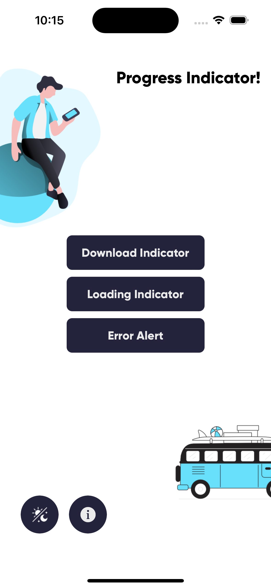
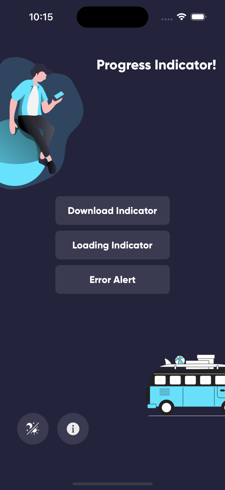
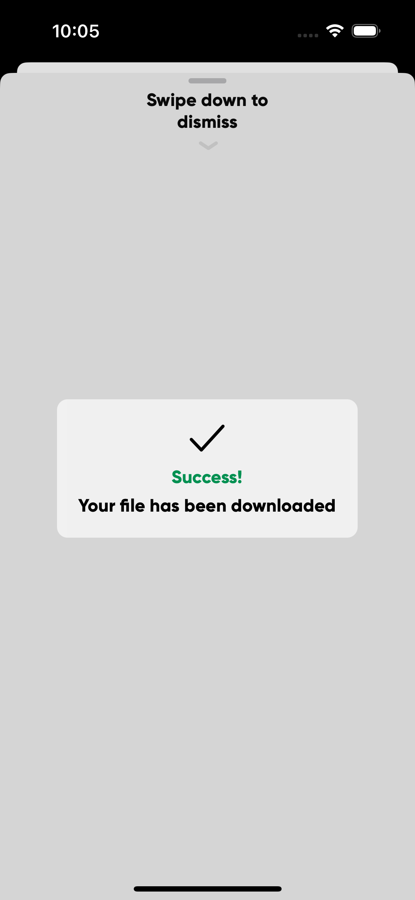

# Progress-Indicators

Creating Loading/Downloading/Error Indicators, Programmatically without Storyboard Using Swift 5.0+

Progress-Indicators is written in Swift 5.0+. It can be built by Xcode 14.0 or later. Compatible with iOS 16.0+.

### Photos Sample

 
 

# Communication and Contribution

- If you **need help**, open an issue and tag as `help wanted`.
- If you **found a bug**, open an issue and tag as `bug`.
- If you **want to contribute**, submit a pull request.
  - In order to submit a pull request, please fork this repo and submit a PR from your forked repo.
  - Have a detailed message as to what your PR fixes/enhances/adds.

## Requirements

In order to compile Progress-Indicators you will need to meet the following requirements:

* iOS 16.0+ / Mac OS X 13.0+
* Xcode 14.0+
* Swift 5.0+
